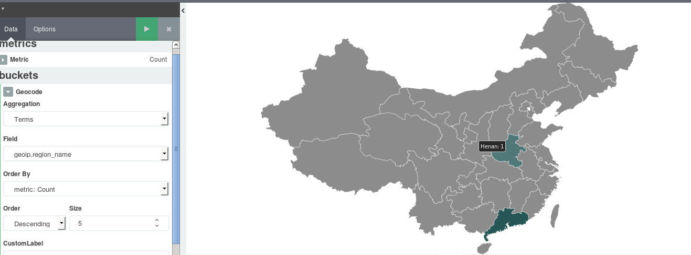

# Kibana Vector Map Plugin
A Vector Map Plugin for Kibana 4


Add CHINA Map

对于中国地图,其所支持的格式则是由 2 个数字构成的省份编码,比如：01(即安徽),30(即广东),04(即江苏)等.如果你使用了 LogStash::Filters::GeoIP 插件,那么默认生成的 geoip.region_name 字段正好符合条件.



### Requirements
Kibana 4.3+ , Not Support Kibana 5.x

### Installation steps
1. Download and unpack [Kibana](https://www.elastic.co/downloads/kibana).
2. From the Kibana root directory, install the plugin with the following command:

```$ bin/kibana plugin -i vectormap -u https://github.com/bigbo/vectormap/archive/master.zip```

### Disclosure
This repo is in its early stages.

This repo contains source code minified from the original source code [jvectormap](https://github.com/bjornd/jvectormap), which is licensed under [AGPL](https://github.com/bjornd/jvectormap/blob/master/LICENSE-AGPL).

### Issues
Please file issues [here](https://github.com/bigbo/vectormap/issues).
